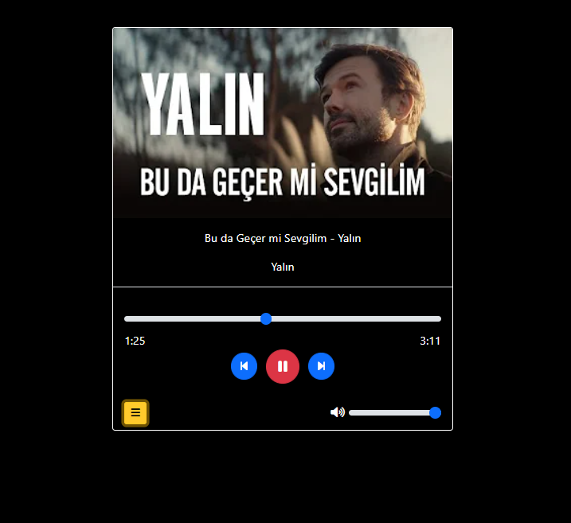
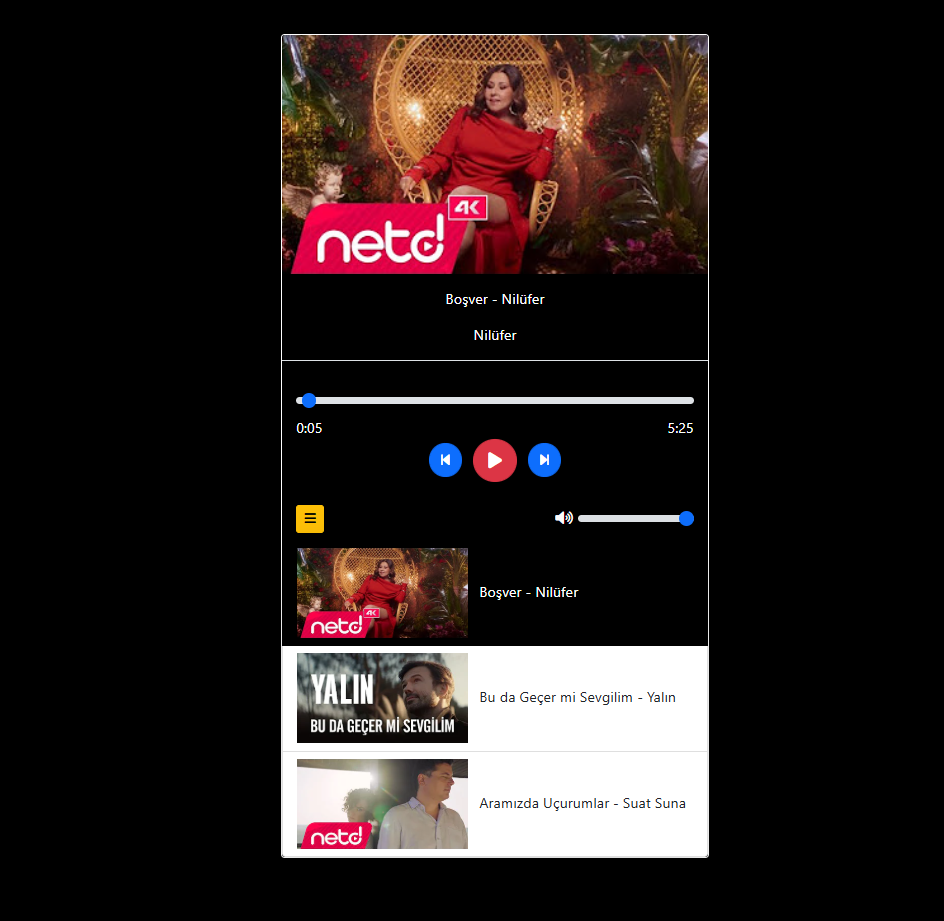

# Music Player

This is a simple music player application built using HTML, CSS, and JavaScript. It allows users to play, pause, and navigate through a list of audio tracks with a clean and user-friendly interface.

---

## Features

- **Play/Pause Functionality**: Users can play or pause the current track.
- **Track Navigation**: Buttons to move to the next or previous track.
- **Dynamic Track Display**: The currently playing track name and image are displayed dynamically.
- **Responsive Design**: Works seamlessly across devices of different screen sizes.

---

## File Structure

```
music-player/
|-- .vscode/
|-- img/
|   |-- 1.jpeg
|   |-- 2.jpeg
|   |-- 3.jpeg
|-- mp3/
|   |-- 1.mp3
|   |-- 2.mp3
|   |-- 3.mp3
|-- app.js
|-- index.html
|-- music.js
|-- musicplayer.js
|-- style.css
|-- .gitattributes
|-- README.md
```

### Explanation of Key Files

- **index.html**: The main HTML file that structures the music player's interface.
- **style.css**: Contains the styling for the application, ensuring a visually appealing layout.
- **app.js / music.js / musicplayer.js**: JavaScript files responsible for the application's core functionality, such as handling events, managing the playlist, and updating the UI dynamically.
- **img/**: Contains the images associated with each track.
- **mp3/**: Contains the audio files to be played by the music player.

---

## How to Use

1. Clone the repository:
   ```bash
   git clone https://github.com/<your-username>/music-player.git
   ```

2. Navigate to the project directory:
   ```bash
   cd music-player
   ```

3. Open the `index.html` file in your browser to launch the music player.

---

## Screenshots




### Folder Structure in VS Code


---

## Contribution Guidelines

Feel free to contribute to the project by:

- Reporting bugs
- Suggesting features
- Submitting pull requests

To contribute:
1. Fork the repository.
2. Create a new branch for your feature/bug fix.
3. Submit a pull request with a clear description of your changes.


---

## Acknowledgments

- Icons and images sourced from free resources.
- Audio tracks used for demonstration purposes.

---

## Contact

If you have any questions or feedback, please reach out to:
- GitHub: [https://github.com/bkaratas]

